# AGSL FX

Библиотека шейдерных эффектов для Jetpack Compose на **AGSL** (Android Graphics Shading Language)
и демо-приложение-витрина к ней.

16 шейдеров, ноль растровых ресурсов: всё, что вы видите ниже, целиком посчитано на GPU.

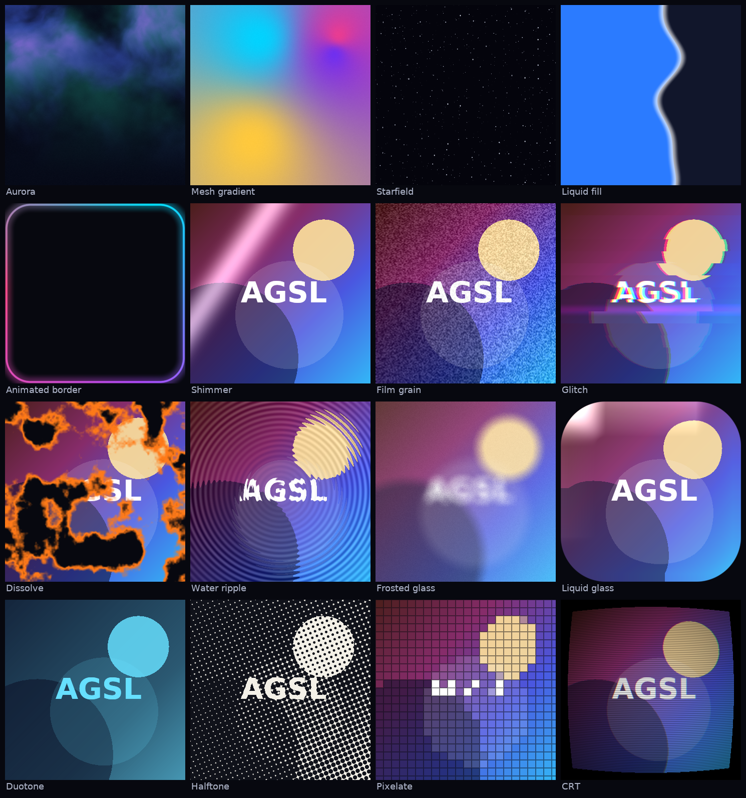

---

## Что внутри

| | |
|---|---|
| `agslfx` | Android-библиотека: ядро + 16 эффектов + готовые компоненты |
| `demo` | Витрина: галерея, живые слайдеры параметров и исходник каждого шейдера прямо в приложении |
| `tools` | Оффлайн-компиляция и рендер шейдеров без устройства (см. [«Проверка шейдеров»](#проверка-шейдеров-без-устройства)) |

**Требования:** Android 13 (API 33) и выше — `RuntimeShader` появился именно там.
Сборка: AGP 9.3, Gradle 9.7, Kotlin 2.4, compileSdk 37, JDK 17+.

---

## Быстрый старт

```kotlin
// settings.gradle.kts — модуль уже подключён в этом проекте
include(":agslfx")

// build.gradle.kts вашего модуля
dependencies {
    implementation(project(":agslfx"))
}
```

Эффект — это обычный `Modifier`:

```kotlin
// бегущий блик поверх любого контента
Box(Modifier.shimmer())

// живой фон
Box(Modifier.fillMaxSize().auroraBackground())

// растворение вместо AnimatedVisibility
DissolveVisibility(visible = isVisible) {
    ProfileCard()
}
```

Свой шейдер подключается тем же ядром — писать boilerplate не нужно:

```kotlin
val MyProgram = AgslProgram(
    name = "My effect",
    body = """
        uniform shader content;
        uniform float2 uResolution;
        uniform float uTime;
        uniform float uAmount;

        half4 main(float2 fragCoord) {
            half4 src = content.eval(fragCoord);
            float wave = sin(fragCoord.y * 0.05 + uTime * 3.0) * uAmount;
            return content.eval(fragCoord + float2(wave * 20.0, 0.0));
        }
    """
)

Box(Modifier.agslEffect(MyProgram) { set("uAmount", 0.5f) })
```

`uResolution` и `uTime` библиотека проставляет сама, в теле доступна
мини-стдлиб из `Agsl.PRELUDE`: `agslHash12`, `agslNoise`, `agslFbm`,
`agslRotate`, `agslLuma`, `agslSdRoundRect`, `agslPremul` / `agslUnpremul`.

---

## Каталог

### Эффекты над контентом

Сэмплят исходную отрисовку композабла через `uniform shader content`
и применяются как `RenderEffect`.

| Превью | API | Что делает |
|---|---|---|
| 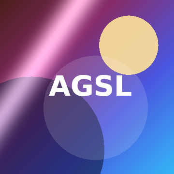 | `Modifier.shimmer()` | Диагональный блик. Основа skeleton-загрузки |
| 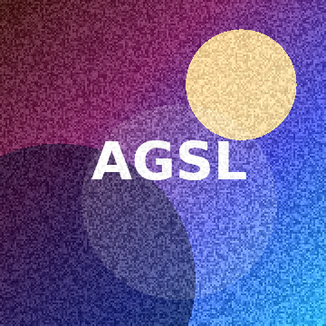 | `Modifier.filmGrain()` | Плёночное зерно, слабее в тенях и светах |
| 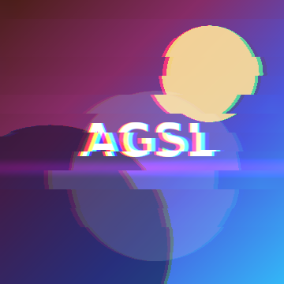 | `Modifier.glitch()` | Сдвиг блоков строк + расхождение RGB |
| 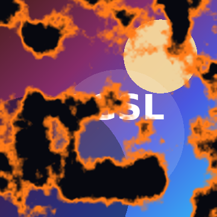 | `Modifier.dissolve(progress)` | Растворение по fbm-шуму с раскалённой кромкой |
| 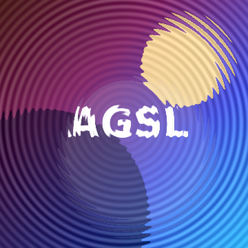 | `Modifier.touchRipple()` | Волна по касанию с преломлением и бликом |
| 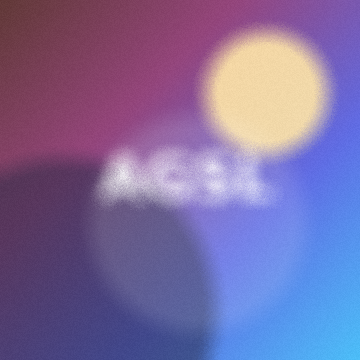 | `Modifier.frostedGlass()` | Матовое стекло, 16 отсчётов по золотой спирали |
| 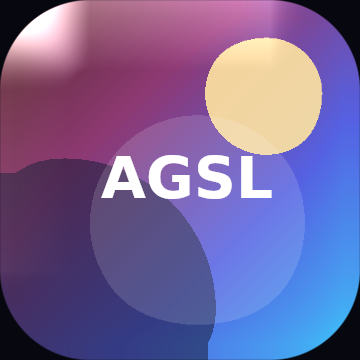 | `Modifier.liquidGlass()` | Стеклянная линза: преломление у краёв + блик на фаске |
| 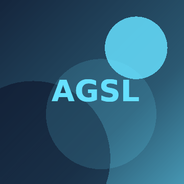 | `Modifier.duotone()` | Яркость раскладывается между двумя цветами |
| 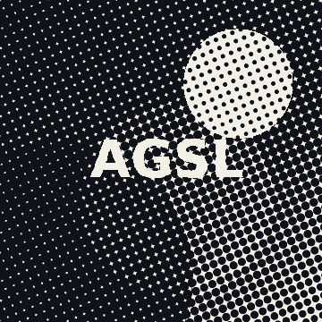 | `Modifier.halftone()` | Полиграфический растр на повёрнутой сетке |
| 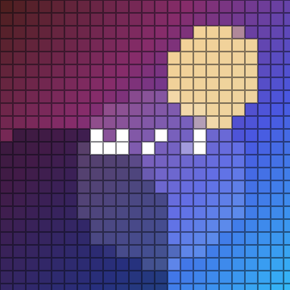 | `Modifier.pixelate()` | Мозаика с зазором — LED-панель |
| 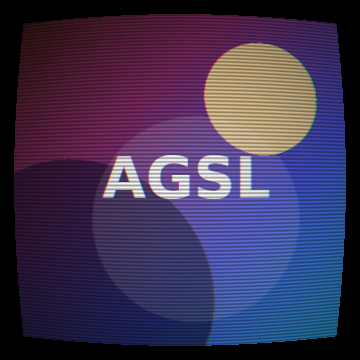 | `Modifier.crt()` | Кинескоп: бочка, строки, аберрация, виньетка |

### Живые фоны

Генеративные шейдеры, рисуются как `ShaderBrush` под контентом.

| Превью | API | Что делает |
|---|---|---|
| 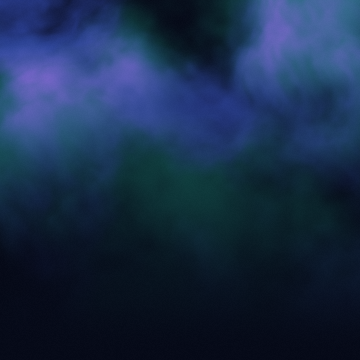 | `Modifier.auroraBackground()` | Северное сияние из двух лент fbm-шума |
| 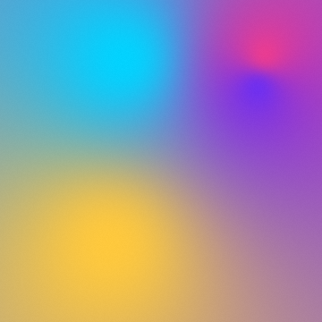 | `Modifier.meshGradient()` | Mesh-градиент: 4 плавающие цветные точки |
| 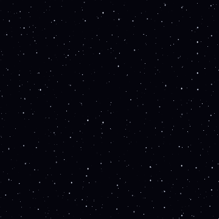 | `Modifier.starfield()` | Три параллаксных слоя мерцающих звёзд |

### Компоненты и декор

| Превью | API | Что делает |
|---|---|---|
| 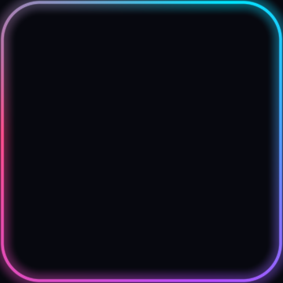 | `Modifier.animatedBorder()` | Вращающаяся коническая обводка со свечением |
| 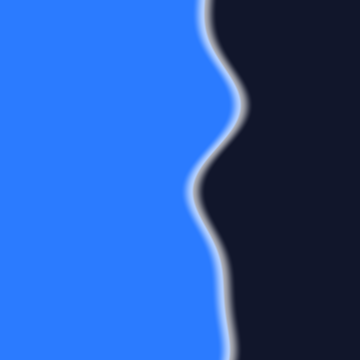 | `Modifier.liquidFill(progress)` | Прогресс с волной на поверхности |
| — | `ShimmerPlaceholder()` | Готовый скелетон-заглушка |
| — | `DissolveVisibility(visible)` | Появление/исчезновение через шумовую маску |
| — | `Modifier.liquidGlassBackdrop(state)` | Стекло, преломляющее **фон под собой** |

---

## Как это устроено

### Кадровое время без рекомпозиции

Наивный способ анимировать шейдер — держать время в `State` и читать его в композабле.
Тогда каждый кадр вызывает рекомпозицию всего поддерева.

`rememberShaderTime()` возвращает `State<Float>`, который читается **внутри**
`graphicsLayer { }` и `onDraw { }`. Compose отслеживает такие чтения отдельно:
меняется только слой, фаза композиции не запускается вовсе.

```kotlin
return this.graphicsLayer {
    val now = time.value          // чтение в draw-фазе, не в composition
    shader.setFloatUniform("uTime", now)
    renderEffect = RenderEffect
        .createRuntimeShaderEffect(shader, "content")
        .asComposeRenderEffect()
}
```

Время берётся из `withInfiniteAnimationFrameMillis`, поэтому автоматически
замирает там, где Compose останавливает бесконечные анимации — в тестах и `@Preview`.

### Стекло, которое преломляет фон

`RenderEffect` в Compose видит только содержимое **своего** слоя. Размыть то,
что нарисовано под композаблом, штатными средствами нельзя — это известное
ограничение, из-за которого «стеклянные» панели обычно подделывают полупрозрачностью.

`BackdropState` решает задачу честно: фон один раз записывается в `GraphicsLayer`,
а стеклянная панель рисует этот слой **у себя внутри** со сдвигом на свою позицию
в корне и уже к нему применяет AGSL.

```kotlin
val backdrop = rememberBackdrop()

Box(
    Modifier
        .fillMaxSize()
        .auroraBackground()
        .backdropSource(backdrop)          // фон пишется в слой
) {
    Box(
        Modifier
            .size(240.dp, 140.dp)
            .clip(RoundedCornerShape(28.dp))
            .liquidGlassBackdrop(backdrop) // панель преломляет именно фон
    )
}
```

В демо эту панель можно таскать пальцем — преломление пересчитывается на лету.

### Премультиплицированная альфа

`content.eval()` возвращает цвет с **предумноженной** альфой, и результат `main()`
Skia тоже ожидает предумноженным. Поэтому эффекты, которые подмешивают свой цвет,
домножают его на `src.a`, а те, что работают с яркостью (дуотон, растр),
сначала зовут `agslUnpremul` и premultiply-ят обратно на выходе. Без этого
эффекты «съезжают» на полупрозрачном контенте.

### Ограничения AGSL, о которых стоит знать

AGSL — это SkSL в профиле, близком к GLSL ES 2.0:

* циклы обязаны иметь границы, известные при компиляции
  (поэтому число октав `agslFbm` и отсчётов размытия — константы);
* нет рекурсии, нет динамической индексации массивов;
* `half` и `float` живут вместе, но приведения лучше писать явно;
* шейдер компилируется в рантайме — синтаксическая ошибка превращается в
  исключение при первом кадре, а не в ошибку сборки.

Последний пункт — главная боль при работе с AGSL. Она решена ниже.

---

## Проверка шейдеров без устройства

AGSL — диалект SkSL, а Skia доступна из Python. Значит те же самые исходники
можно **скомпилировать и отрисовать на CI**, без эмулятора и телефона.

```bash
pip install skia-python

python3 tools/validate_agsl.py     # компилирует все шейдеры, ненулевой код при ошибке
python3 tools/render_previews.py   # рендерит docs/preview/*.png и контактный лист
```

Все превью в этом README отрисованы вторым скриптом из тех же констант,
которые компилируются на устройстве, — картинки не могут разойтись с кодом.

Валидация подключена и как Gradle-задача:

```bash
./gradlew :agslfx:validateAgsl
```

---

## Сборка и запуск

```bash
./gradlew :demo:assembleDebug      # APK витрины
./gradlew :demo:installRelease     # поставить на подключённый телефон
./gradlew :agslfx:publishToMavenLocal
```

Готовый подписанный релизный APK лежит в [`artifacts/agsl-fx-demo.apk`](artifacts/agsl-fx-demo.apk) —
1,8 МБ, ставится на любой Android 13+.

---

## Структура

```
agslfx/src/main/kotlin/com/mikhailov/agslfx/
├── core/          AgslProgram, PRELUDE, agslEffect/agslBackground, кадровое время
├── effect/        эффекты над контентом
├── background/    генеративные фоны
├── decor/         обводка и прогресс-заливка
└── component/     готовые компоненты и backdrop-стекло

demo/src/main/kotlin/com/mikhailov/agslfx/demo/
├── catalog/       описание всех демо: параметры, превью, тексты
└── ui/            галерея, экран эффекта, тема

tools/             оффлайн-компиляция и рендер шейдеров
docs/preview/      превью, отрисованные из исходников шейдеров
```

## Лицензия

MIT — см. [LICENSE](LICENSE).
